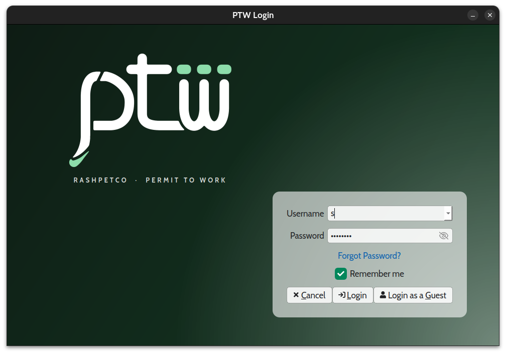
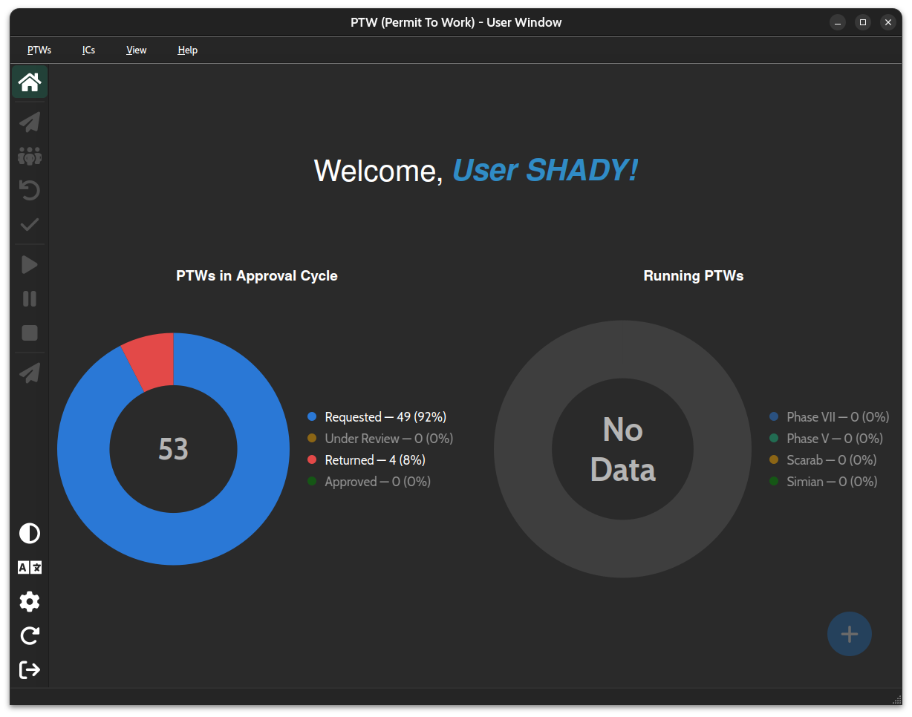
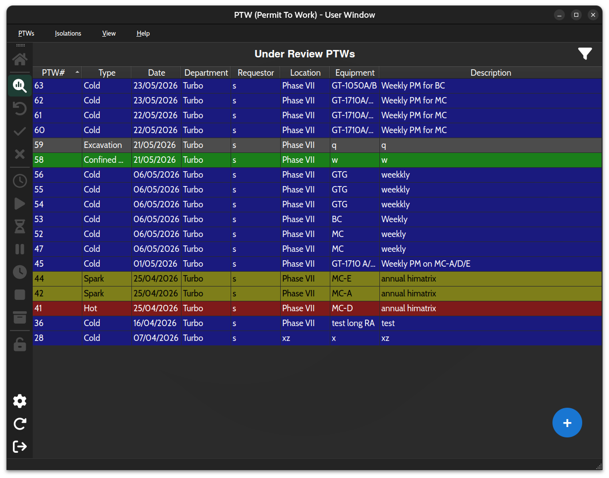
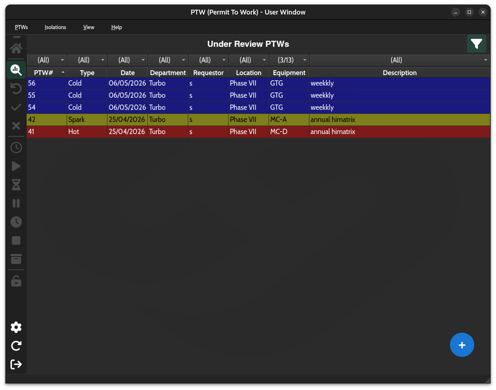
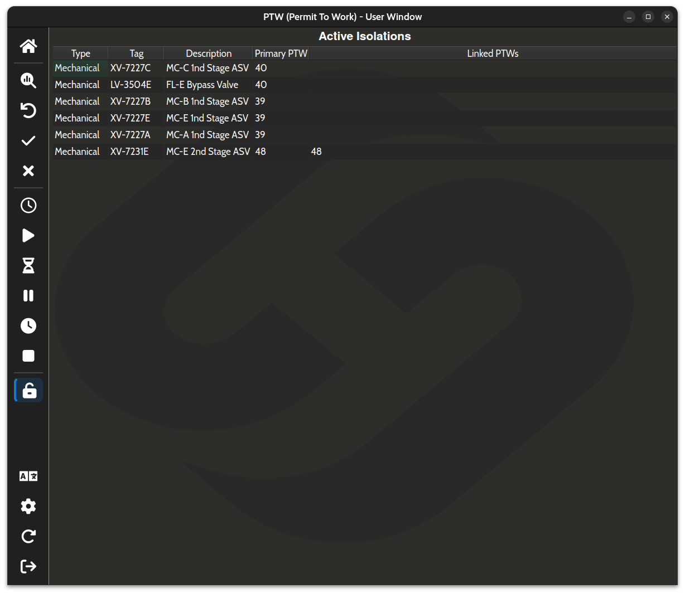
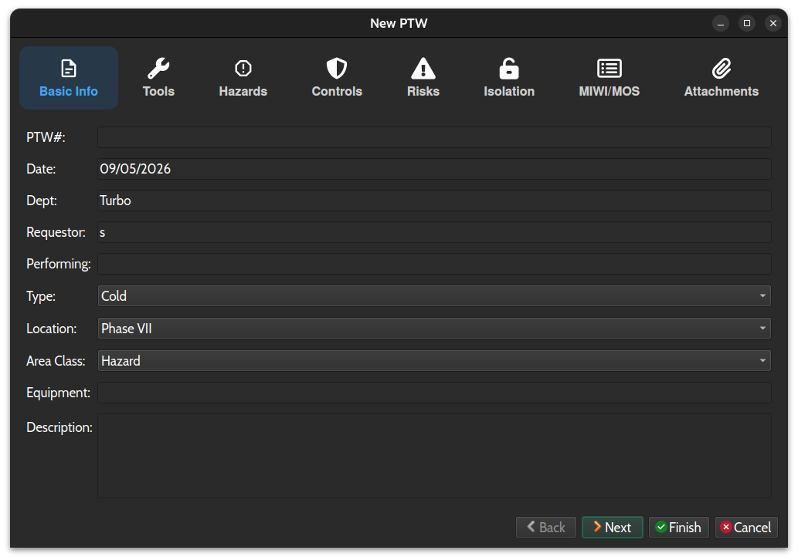
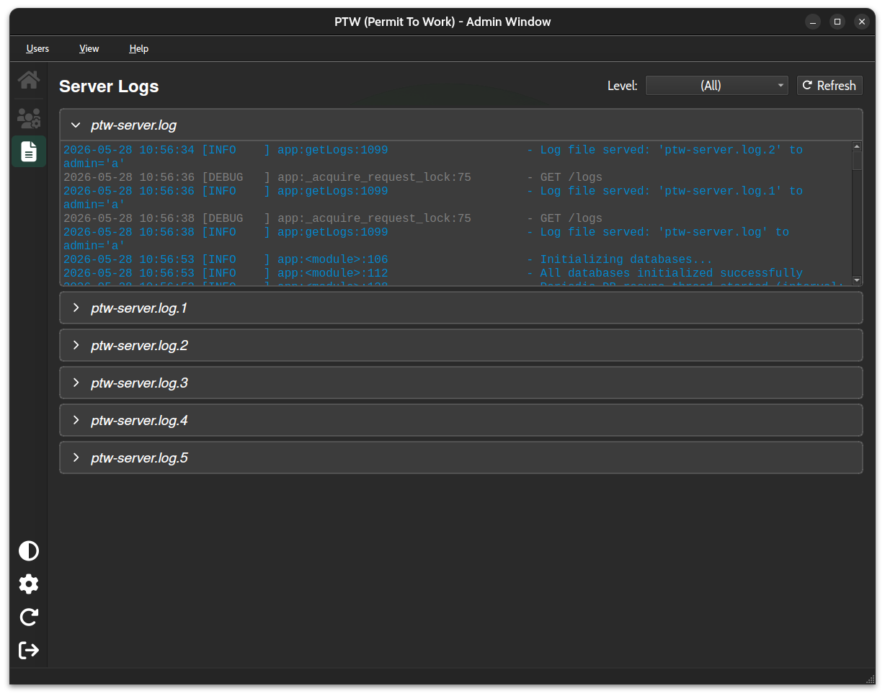

# PTW — Permit To Work System

A desktop-based **Permit To Work (PTW)** management system built for industrial operations. It enforces a structured, multi-stage safety workflow that governs when and how maintenance or hazardous work is authorized, executed, and closed — with full audit trails, equipment isolation tracking, and role-based access control.

---

## Screenshots

**Login:**


**Home Dashboard:**


**PTW List:**


**PTW List Filtered:**


**Isolations:**


**New PTW Form:**


**Server Logs:**


---

## Features

- **Home dashboard** — live donut charts summarizing PTWs in the approval cycle and Running PTWs by location (Users by Department for Admins); click a segment to jump straight to that tab, filtered where relevant
- **Multi-stage approval workflow** — Coordinator → Issuing → Safety → Management chain (PDH → PGM → SOD → DFGM)
- **Full running lifecycle** — Run / Hold / Close with two-party confirmation (Performing Authority + Issuing Authority)
- **Equipment isolation management** — a PTW declares what isolations it needs (type/tag/description); an **IC (Isolation Certificate)** is the actual approval + physical-execution document, linked to the PTW — a PTW can't run unless every linked IC is confirmed isolated
- **Isolation Certificates (ICs)** — formal isolation request documents (type, location, equipment, reason, isolation items) with their own staged approval chain (Issuing, plus PDH→PGM→SOD→DFGM for a PSIC — a "Protective System IC", any IC type flagged as protecting a safety system — this manager approval lives only here, not duplicated on the PTW), a full isolate/de-isolate execution cycle (request → Issuing confirms → Isolator carries out, both directions), their own Requested/Under Review/Pending/Active/Sanctioned/Closed lifecycle, color-coded by isolation type (Mechanical=gray, Electrical=yellow, Self=green, Other=neutral gray — a PSIC overrides this and renders red, same as the old `Protective System` type used to), a two-pane approval/isolation history timeline, bidirectional PTW↔IC linking (link and unlink from either side), and a dedicated Isolator role window *(sanction-for-test and re-isolate cycles not yet implemented)*
- **P&ID / Wiring highlighting** — attach diagrams (PDF or scanned image) to an IC and every isolation item's tag is automatically located and highlighted — red for Open, green for Closed — using native PDF text search with an OCR fallback (Tesseract) for scanned pages/images with no text layer; highlights are burned permanently into the file (visible in any external viewer, not just this app), can be manually added/adjusted/deleted with live drag-and-resize, and stay in sync with the items list via a one-click Sync
- **Color-coded permit types** — Cold Work (blue), Spark (yellow), Hot Work (red), HydroCarbon (black), Excavation (gray), Confined Space (green)
- **Risk assessment library** — Safety team maintains a reusable generic risk assessment library; each PTW gets its own editable, deduplicated risk item table — built by adding items manually, pulling from the generic library, or importing an Excel/CSV file — that becomes its permanent risk record, carried over automatically on re-request
- **PDF permit reports** — Printable PDF generation for each PTW
- **Excel export** — Export the PTW list to a formatted, color-coded `.xlsx` spreadsheet
- **Real-time notifications** — Server-Sent Events (SSE) push PTW changes to all connected clients instantly; no polling required. Closing the window prompts to keep running in the system tray instead of quitting, so notifications keep arriving in the background — the choice can be remembered (skipping the prompt on later closes) and changed anytime in Settings; reopen from the tray icon straight back into the same session, no re-login needed
- **Archived permits** — Closed PTWs can be archived manually, or automatically 7 days after closing via a server-side background sweep; archived data is fetched on-demand only to reduce server overhead
- **File attachments** — Per-permit document uploads (medical certificates, tool checklists, technical drawings)
- **MIWI documents** — Per-department Maintenance & Work Instruction PDFs referenced across permits; approver roles can view across all departments, other roles are confined to their own
- **Role-based UI** — Each of 11 roles gets a tailored interface showing only relevant actions and data
- **Guest access** — Anyone can log in as a Guest (name + free-text department, no account needed) to create and track their own PTWs
- **Invitation email** — New users get an emailed username + auto-generated password on account creation
- **Forced password change** — every new account (including the first-boot admin) must change its auto-generated password on first login, gated client-side before the main window opens; an admin can also force this on an existing account at any time
- **Password reset via email** — 6-digit verification code sent via Gmail SMTP, expires in 15 minutes
- **Multi-language support** — Language switching built into the UI
- **Server activity logging** — rotating log files (10 MB, 5 backups) with DEBUG/INFO/WARNING/ERROR/CRITICAL levels; log lines include timestamp, level, and source location
- **Admin log viewer** — dedicated tab for Admins with collapsible per-file panels, lazy loading, per-level color coding, and a level filter
- **Light/dark theme** — full UI theme switching (system / light / dark) with preference saved server-side per user
- **Type-aware safety rules** — tools, hazards, and controls can be required, restricted, or trigger cascading requirements (e.g. a hazard requiring an attachment) depending on the permit type; enforced in the UI and independently re-validated server-side on submit

---

## Technology Stack

| Layer         | Technology                            |
|---------------|---------------------------------------|
| Client UI     | Python 3.12+, PyQt6, qtawesome        |
| HTTP Client   | `requests` (Basic Auth + SSE stream)  |
| Server        | Python 3.12+, Flask                   |
| Database      | PostgreSQL (psycopg2)                 |
| Email         | Flask-Mail (Gmail SMTP)               |
| Credentials   | `keyring`                             |
| Reports       | ReportLab (PDF), Pillow, qrcode       |
| PDF/OCR       | `pypdf`, PyQt6 `QtPdf` (native text search), `pytesseract`/Tesseract (OCR fallback) |
| Excel Export  | `openpyxl`                            |
| Distribution  | Nuitka `--onedir` → zipped for release (Windows + Linux) |

---

## PTW Types

| Code | Name           | Color  | Use Case                     |
|------|----------------|--------|------------------------------|
| CW   | Cold Work      | Blue   | Non-spark generating work    |
| SP   | Spark          | Yellow | Work that may produce sparks |
| HT   | Hot Work       | Red    | Open flame / welding         |
| HC   | HydroCarbon    | Black  | Work near HC systems         |
| EX   | Excavation     | Gray   | Ground excavation work       |
| CS   | Confined Space | Green  | Work inside confined spaces  |

---

## User Roles

| Role | Responsibilities |
| --- | --- |
| **User** | Creates PTWs; requests run, hold, and close |
| **Coordinator** | Reviews and approves PTWs in the coordination stage |
| **Issuing** | Authorizes execution; accepts/rejects run, hold, close confirmations |
| **Safety** | Safety approvals; creates and manages risk assessments |
| **PDH** | Production/Plant Department Head approval |
| **PGM** | Production General Manager approval |
| **SOD** | System/Operation Director approval |
| **DFGM** | Direct Field General Manager — highest approval authority |
| **Isolator** | Manages physical equipment isolations |
| **Guest** | Unauthenticated visitor; creates/views PTWs |
| **Admin** | Full system access; manages all users |

---

## PTW Lifecycle

### Approval Cycle

```text
Coordinator → Issuing → Safety → [PDH → PGM → SOD → DFGM]
```

**Statuses:** `UNDER_REVIEW` → `APPROVED` / `RETURNED` / `REJECTED`

### Running Cycle

Once approved, the permit enters a state machine driven by the Performing Authority (PA) and Issuing Authority (IA):

```text
NOT_RUNNING
    │
    │ [Performing Authority (PA) sends run request]
    │
    ▼
WAITING_RUN_CONFIRM
    │                      
    ├───────────────────────────────────────────┐
    │                                           │
    │ [Issuing Authority (IA) accepts]          │ [IA rejects]
    │                                           │
    ▼                                           ▼
 RUNNING                                  NOT_RUNNING (back to approved)
    │
    │
    ├──── [PA sends close request]
    │         │
    │         │
    │         ▼
    │     WAITING_CLS_CONFIRM
    │         │
    │         ├─────────────────────────────────┐
    │         │                                 │
    │         │ [IA accepts]                    │ [IA rejects]
    │         │                                 │
    │         ▼                                 ▼
    │       CLOSED                           RUNNING (returns)
    │         │
    │         │ [Archive — manual, or automatic after 7 days]
    │         │
    │         ▼
    │      ARCHIVED
    │
    │
    └──── [PA sends hold request + selects which ICs to keep held]
              │
              │
              ▼
          WAITING_HLD_CONFIRM
              │
              ├─────────────────────────────────┐
              │                                 │
              │                                 │
              │ [IA accepts]                    │  [IA rejects]
              │                                 │
              ▼                                 ▼
            HELD                             RUNNING (returns)
              │
              └──── [Can resume back to be RUNNING]
```

---

## Isolation Management

Isolations are safety locks placed on equipment to prevent accidental energization during active work. `Isolation` (type/tag/description) is a purely declarative record of what a PTW needs — it carries no runtime state and there's no global registry of it. All actual isolation execution, approval, and PTW linkage happens via **IC (Isolation Certificate)**, below.

**Types:** Mechanical · Electrical · Self · Other

### Isolation Certificates (IC)

A separate, formal request workflow for isolation work — an IC's `items` are isolation tags/points, and the IC itself is the approval document around them, plus the sole place PTW↔isolation linkage state lives (`linked_ptws`/`held_by`).

**PSIC (Protective System IC):** any IC, regardless of its `type`, can be flagged `is_psic` — meaning it isolates a protective system such as ESD, Fire Protection, Fire Detection, Gas Detection, or a Protection System. Nobody sets this at creation any more: **Issuing** flags `is_psic` as part of approving their own stage, and **Coordinator's approval of the following stage** (added to the chain only for a PSIC) is what supplies its terms — reasons (a client-defined, multi-select list; at least one required), an optional MOC number, and three required fields (system to be isolated, method of isolation, control measure/mitigation), which can be autofilled from a selected isolation item's tag (sample data for now). There's no separate "define terms" action — approving that stage and supplying the terms happen together, in one submission.

- **Lifecycle:** `Requested` → (staged approval — Issuing, then Coordinator, then PDH→PGM→SOD→DFGM for a PSIC) → `Approved` → (isolate request → Issuing confirms → Isolator carries out) → `Active` → (de-isolate request → Issuing confirms → Isolator carries out) → `Closed`, with a `Sanctioned` (for-test) side branch
- **Roles:** requestor (User) creates an IC; Issuing approves first (and may flag it as a PSIC); for a PSIC, Coordinator approves next (defining its terms), then PDH/PGM/SOD/DFGM in sequence; Isolator physically carries out both the isolate and de-isolate steps
- **PTW linkage:** either side can link/unlink — a "Link to IC" action on the PTW, a "Link to PTW" action on the IC, and an Unlink button on both sides' linkage tabs. **A PTW can't be accepted into `RUNNING` unless every IC it's linked to is `Active`** (confirmed isolated) — enforced server-side at run-accept.
- **P&ID / Wiring:** attach one or more diagrams (PDF or image) while creating the IC; isolation-item tags are found via native PDF text search or OCR (Tesseract, English-only) and highlighted directly in the file — red for Open, green for Closed. Highlights can be manually added, dragged, resized, or deleted, always live (no separate edit mode), and re-sync with the items list on request. See [PROJECT.md](PROJECT.md#pid--wiring-highlighting) for the full breakdown.
- **Implemented:** data model, dialogs, create/list round trip, full staged approval chain, the complete isolate and de-isolate execution cycles, bidirectional PTW↔IC linking, and P&ID/wiring highlighting. **Not yet implemented:** sanction-for-test and re-isolate cycles (tabs exist in the UI but stay empty), PTW reports printing linked ICs, and — since ICs have no edit flow at all — attaching a P&ID/wiring document to an IC after it's already been submitted.

---

## Project Structure

```text
ptw/
├── .github/workflows/build.yml  # CI/CD — builds Windows + Linux binaries via Nuitka
├── dev-scripts/                 # One-off dev/maintenance scripts (DB migrations, etc.) — gitignored, not part of the app
├── client/                      # PyQt6 desktop application
│   ├── main.py                  # Entry point
│   ├── Login.py                 # Login & password reset
│   ├── windows/                 # Main window classes — one file per role, all subclass MainWindow
│   │   ├── MainWindow.py        #   Base class: chrome, PTW/IC action handlers, SSE sync, home dashboard
│   │   ├── UserMainWindow.py    #   Requestor (PA) role window
│   │   └── ...                  #   GuestMainWindow, CoordinatorMainWindow, IssuingMainWindow, SafetyMainWindow, ManagerMainWindow, AdminMainWindow, IsolatorMainWindow
│   ├── GlobalData.py            # Client-side data cache
│   ├── models/                  # Data model classes
│   │   ├── PTW.py               #   Client-side data models
│   │   ├── Isolation.py         #   Declarative Isolation + IC
│   │   └── User.py              #   User model
│   ├── network/                 # HTTP + realtime plumbing
│   │   ├── clientRequests.py    #   ClientRequests — composes the *Requests mixins below
│   │   ├── requestConfig.py     #   SERVER_URL, TIMEOUT, FILE_TIMEOUT
│   │   ├── authRequests.py      #   AuthRequests mixin — login, password reset
│   │   ├── userRequests.py      #   UserRequests mixin — user CRUD, theme, active status
│   │   ├── ptwRequests.py       #   PTWRequests mixin — PTW CRUD, attachments, run/hold/close
│   │   ├── icRequests.py        #   ICRequests mixin — IC CRUD, attachments, isolate/deisolate, link
│   │   ├── riskRequests.py      #   RiskRequests mixin — risk assessment CRUD
│   │   ├── documentRequests.py  #   DocumentRequests mixin — MIWI documents
│   │   ├── adminRequests.py     #   AdminRequests mixin — logs, backups
│   │   ├── RequestWorker.py     #   @async_request decorator — runs requests off the GUI thread
│   │   └── SSEListener.py       #   Real-time event listener (QThread)
│   ├── dialogs/                 # Modal dialogs
│   │   ├── TabbedDialog.py      #   Base class for DialogPTW/DialogIC: tab bar + Back/Next/Finish/Cancel
│   │   ├── DialogPTW.py         #   Full PTW form (create/view/edit)
│   │   ├── DialogIC.py          #   IC create/view dialog (new/readOnly modes)
│   │   ├── DialogIsolationItem.py
│   │   └── ...                  #   DialogUser, DialogSettings, DialogIsolation, etc.
│   ├── tables/                  # Embedded/tab list widgets
│   │   ├── TablePTWs.py         #   PTW list with filters + Excel export
│   │   ├── TableICs.py          #   IC list (one instance per tab, mirrors TablePTWs)
│   │   ├── TableIsolationItems.py  # Embedded editable isolation-item list inside the IC dialog
│   │   └── ...                  #   TableUsers, TableRisks, TableAttachments, TableIsolations
│   ├── widgets/                 # Reusable standalone widgets
│   │   ├── WidgetPidWiring.py   #   P&ID/Wiring tab: document picker, preview, live highlight editing
│   │   ├── PidWiringHighlighter.py  # Highlight detection (PDF text search + OCR) and file burn-in
│   │   ├── DonutChart.py        #   Reusable donut-chart widget powering the home-page dashboard
│   │   └── ...                  #   TabServerLogs, CheckableComboBox, SearchableComboBox, UiUtils, RefreshOverlay
│   ├── reports/
│   │   ├── ReportGenerator.py   #   PDF and Excel report generation
│   │   └── ImportUsersExcel.py  #   Bulk user Excel/CSV import
│   ├── helper/                  # Small shared, stateless helpers
│   │   ├── utils.py             #   resource_path, objToDict, dictToObj
│   │   ├── i18n.py              #   Language/RTL init
│   │   └── OcrConfig.py         #   Points pytesseract at the bundled Tesseract binary when frozen
│   ├── assets/                  # Bundled images and icons
│   └── fonts/                   # Bundled fonts
│
└── server/                      # Flask REST API
    ├── app.py                   # Thin entrypoint — registers blueprints, app.run()
    ├── core.py                  # Flask/Mail app, DB singletons, globalData init, syncPtwCache
    ├── paths.py                 # BASE_DIR (code) vs DATA_DIR (miwi/logs/backups/attachments), resolveMiwiPath
    ├── loggingSetup.py          # Logging handlers/format
    ├── sse.py                   # SSE client registry + broadcast()
    ├── backupService.py         # DB dump + file archive backup helpers
    ├── routes/                  # One Blueprint per resource
    │   ├── auth.py               #   /login, /reset-password*, /events (SSE) + getVerifiedUser
    │   ├── users.py               #   /user(s), /users/theme, /users/active
    │   ├── ptws.py                #   /ptws* — CRUD, approvals, run/hold/close, attachments
    │   ├── ics.py                 #   /ics* — CRUD, approvals, isolate/deisolate, link/unlink, attachments
    │   ├── risks.py               #   /risks*
    │   ├── documents.py           #   /miwi(s)
    │   └── admin.py               #   /logs, /backups
    ├── GlobalData.py            # Server-side in-memory cache
    ├── utils.py                 # Shared helpers (objToDict, dictToObj)
    ├── models/
    │   ├── PTW.py                #   Core data models & enums
    │   ├── Isolation.py          #   Server-side model (declarative Isolation + IC)
    │   └── User.py               #   User model (UserRoles enum, SecuredUser, User classes)
    └── db/
        ├── commonDb.py           #   Shared DB base class (ThreadedConnectionPool, generic CRUD)
        ├── ptwDb.py               #   PTW database operations
        ├── usersDb.py             #   User database operations
        ├── ICDb.py                #   IC database operations (table `ics`)
        └── risksDb.py             #   Risk assessment DB operations
```

Generated content (MIWI PDFs, logs, on-demand DB backups, PTW/IC attachment folders) is **not**
under `server/` — it lives in `paths.DATA_DIR`, an OS-appropriate per-machine directory outside
the repo by default (override with the `PTW_DATA_DIR` env var). See `server/paths.py`.

---

## Setup

### Prerequisites

- Python 3.10+
- PostgreSQL
- Gmail account (for password reset emails)

### Database

Create the PostgreSQL database:

```sql
CREATE DATABASE ptw_database;
```

Tables (`users`, `ptws`, `ics`, `risks`) are auto-created on first server start — see [PROJECT.md](PROJECT.md) for the full schema.

### Server

```bash
cd server
pip install flask flask-mail psycopg2 python-dotenv bcrypt waitress
python app.py
```

`python app.py` serves via **waitress**, bound to `127.0.0.1:5000` — not exposed to the network by itself. For any real (non-localhost) deployment, put a TLS-terminating reverse proxy in front of it; see [HTTPS Deployment](#https-deployment) below. Running against a bare `python app.py` with no proxy is fine for local development only.

Create a `server/.env` file with your credentials:

```ini
DB_HOST=localhost
DB_NAME=ptw_database
DB_USER=postgres
DB_PASSWORD=your_password
MAIL_USERNAME=your-email@gmail.com
MAIL_PASSWORD=your_app_password
```

> **First deployment:** On first boot with an empty database, a random admin password is generated and printed once to the server log at `WARNING` level. Look for the line:
>
> ```text
> INITIAL ADMIN PASSWORD: <generated-password>
> ```
>
> The account is flagged to require a password change, so the client will prompt for a new one right after that first login.

### Client

```bash
cd client
pip install PyQt6 qtawesome requests keyring reportlab pillow qrcode pypdf openpyxl bcrypt pytesseract arabic-reshaper python-bidi python-dotenv
python main.py
```

The server address defaults to `http://localhost:5000`, for local dev against a bare `python app.py`. To point at a real server, copy `client/.env.example` to `client/.env` and fill in `PTW_SERVER_URL`/`PTW_CA_CERT_PATH` (plain OS environment variables also work, and take precedence over `.env`) — see [HTTPS Deployment](#https-deployment) below.

---

## HTTPS Deployment

The server itself never terminates TLS — it's meant to sit behind a reverse proxy on the same machine, with the proxy handling HTTPS and forwarding plain HTTP to the server on `127.0.0.1` only. There's no CA involved: a single self-signed cert is generated once and pinned directly by every client, rather than validated against a trust store.

1. **Generate the cert** (once per deployment, or whenever the server's IP/hostname changes):
   ```bash
   server/deploy/generate_cert.sh <server-static-ip-or-hostname>
   ```
   Writes `server/certs/server_key.pem` (keep on the server, mode 600) and `server/certs/server_cert.pem` (the public half to distribute to clients) — and also drops a copy at `client/certs/dev-server-cert.pem` in this checkout, for local dev/testing against this same machine.

2. **Stand up nginx** using `server/deploy/ptw.conf` as a starting point — update its `ssl_certificate`/`ssl_certificate_key` paths to the files above, then include/symlink it into nginx's config and reload. It proxies to the server on `127.0.0.1:5000` and gives the real-time `/events` (SSE) endpoint the buffering/timeout settings it needs to actually stream through a proxy.

3. **Start the server** (`python app.py`, from `server/`) — it binds to `127.0.0.1:5000`, reachable only via the proxy above.

4. **Point each client at the proxy**, via `client/.env` (copy `client/.env.example` — it's also bundled into every release zip, see `.github/workflows/build.yml`) or real OS environment variables:
   ```bash
   PTW_SERVER_URL=https://<server-static-ip-or-hostname>
   PTW_CA_CERT_PATH=/path/to/server_cert.pem   # copy the public cert from step 1 onto this client machine first
   ```
   `PTW_CA_CERT_PATH` is used as `requests`' `verify=` value — this is a pinned-cert check, not a "skip verification" flag; every client needs its own local copy of the real `server_cert.pem`. A relative value resolves against the client's own install directory (not the process's working directory), so prefer that over a hardcoded absolute path where possible — e.g. drop the cert at `client/certs/<name>.pem` and just reference `certs/<name>.pem`.

   `client/.env` (like `server/.env`) is never committed to git or baked into the CI-built release zip — it's deployment-specific, so it's created by hand on each client machine (dropped next to the installed app for a packaged build, or in `client/` when running from source).

Client and server must be switched over together — a client still pointed at `http://` breaks once the server stops serving plain HTTP externally, and there's no partial/gradual migration path between the two. See `KNOWN_ISSUES.md`'s H2 entry for the full background.

---

## API Overview

| Category | Endpoints |
| --- | --- |
| Auth | `POST /login` · `POST /reset-password-request` · `POST /reset-password` |
| Users | `GET/POST/PUT/DELETE /users` |
| PTWs | `GET/POST/DELETE /ptws` |
| Approvals | `POST /ptws/approvals` |
| Run cycle | `POST /ptws/run-request` · `POST /ptws/run` |
| Hold cycle | `POST /ptws/hold-request` · `POST /ptws/hold` |
| Close cycle | `POST /ptws/close-request` · `POST /ptws/close` |
| Attachments | `GET/POST/DELETE /ptws/attachments` · `POST /ptws/attachments/copy` |
| ICs | `GET/POST /ics` · `POST /ics/approvals` · `POST /ics/isolate-request` · `POST /ics/isolate-confirm` · `POST /ics/isolate-execute` · `POST /ics/deisolate-request` · `POST /ics/deisolate-confirm` · `POST /ics/deisolate-execute` · `POST /ics/link-ptw` · `POST /ics/unlink-ptw` |
| IC attachments (P&ID/Wiring) | `GET/POST/DELETE /ics/attachments` |
| Risks | `GET/POST/PUT/DELETE /risks` |
| MIWI docs | `GET /miwi` · `GET /miwis` · `POST /miwi` |
| Archive | `GET /ptws/archive` · `POST /ptws/archive` |
| Backups | `GET/POST/DELETE /backups` (Admin only) |
| Logs | `GET /logs` (Admin only) |
| Events (SSE) | `GET /events` |

Full API reference in [PROJECT.md](PROJECT.md).

---

## Building for Distribution

Pre-built releases for Windows and Linux are produced automatically via GitHub Actions on every version tag:

```bash
git tag v1.x.x
git push origin v1.x.x
```

Download `PTW-windows.zip` and `PTW-linux.zip` from the **Releases** page. Extract the zip and run `PTW.exe` (Windows) or `PTW` (Linux) from the extracted folder.

Builds use **Nuitka** (`--onedir`) for native compilation — the app folder is zipped before upload. To trigger a manual build without a tag: **Actions → Build PTW → Run workflow**.

---

## Known Limitations

See [KNOWN_ISSUES.md](KNOWN_ISSUES.md) for the full security and bug backlog with fix guidance.
